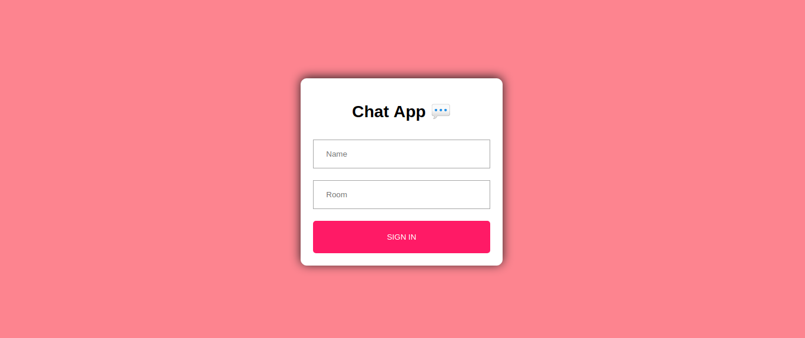
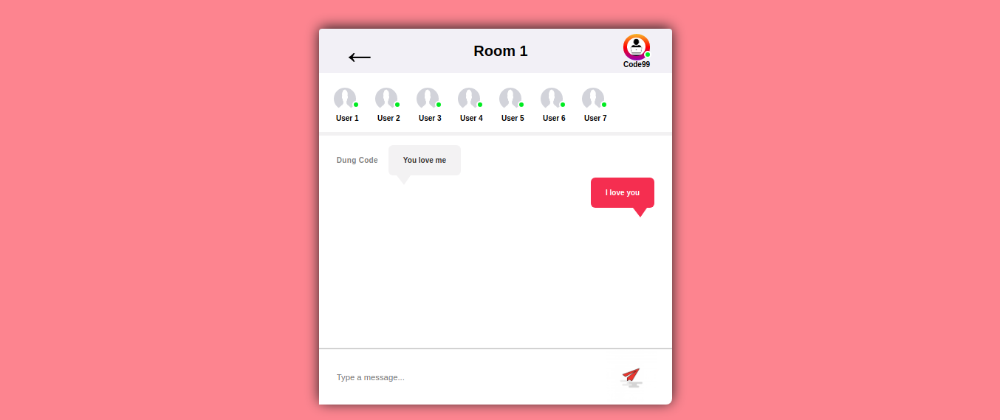

# Realtime Chat Application - Socket.io, Node.js, and React.js


## Install
- client
    - npx create-react-app client
    - npm install --save socket.io-client
    - react-scroll-to-bottom
    - react-emoji
    - query-string
    - react-router-dom

- server
    - npm init -y
    - npm install --save cors
    - nodemon
    - express
    - socket.io
        ```jsx
            "scripts": {
                "start": "nodemon index.js",
                "test": "echo \"Error: no test specified\" && exit 1"
            },
        ```

## Client

- **components**
    - `Join.js`
    - `Chat.js`


## Server
- **index.js**
- **routes**
    - `index.js`